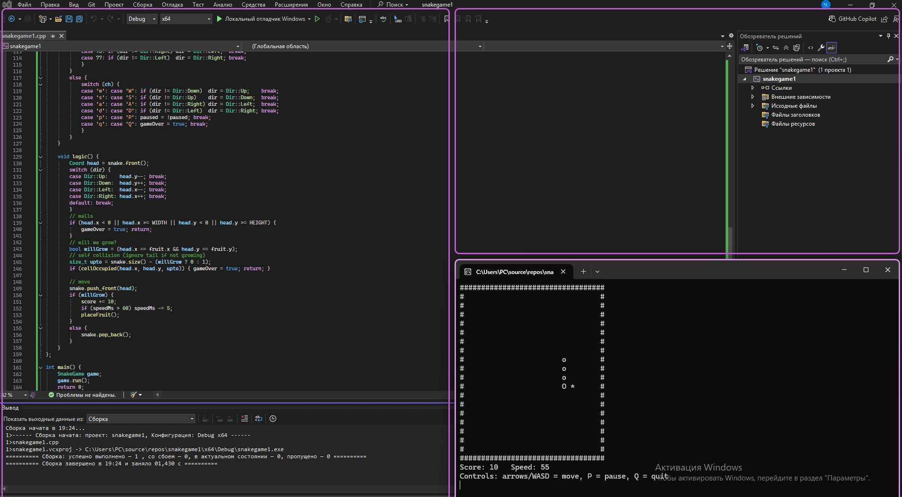

# 🐍 C++ Console Snake

A minimal, **no-dependency** Snake game for Windows console (MSVC or MinGW).  
Arrow keys or **W/A/S/D** to move, **P** to pause, **Q** to quit. Eat `*` to grow.

## ▶️ Build & Run (Windows)

### Option A — MSVC (Developer Command Prompt)
```bat
cl /EHsc /std:c++17 src\main.cpp /Fe:snake.exe
snake.exe
```

### Option B — MinGW (g++)
```bash
g++ -std=c++17 src/main.cpp -o snake.exe
./snake.exe
```

### Option C — CMake (MSVC or MinGW)
```bash
cmake -S . -B build
cmake --build build --config Release
./build/Release/snake.exe   # MSVC
# or ./build/snake.exe      # MinGW
```

## Controls
- **← ↑ → ↓** or **W A S D** — move
- **P** — pause / resume
- **Q** — quit

## Project Structure
```
cpp-snake/
 ├─ src/main.cpp
 ├─ CMakeLists.txt
 ├─ LICENSE
 └─ .gitignore
```

## Notes
- Uses `<conio.h>` and `Sleep()` from `windows.h` → targets Windows.
- Simple single-file code; easy to extend (score persistence, walls, levels).


## 📸 Example

Example of fetching and searching articles:


